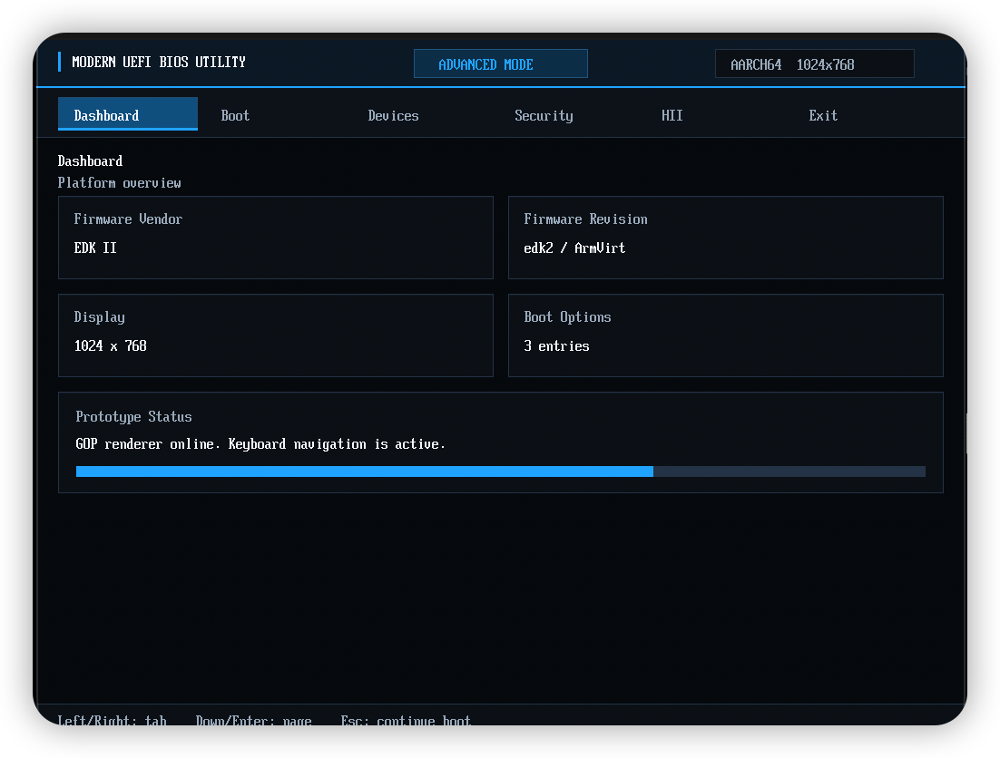
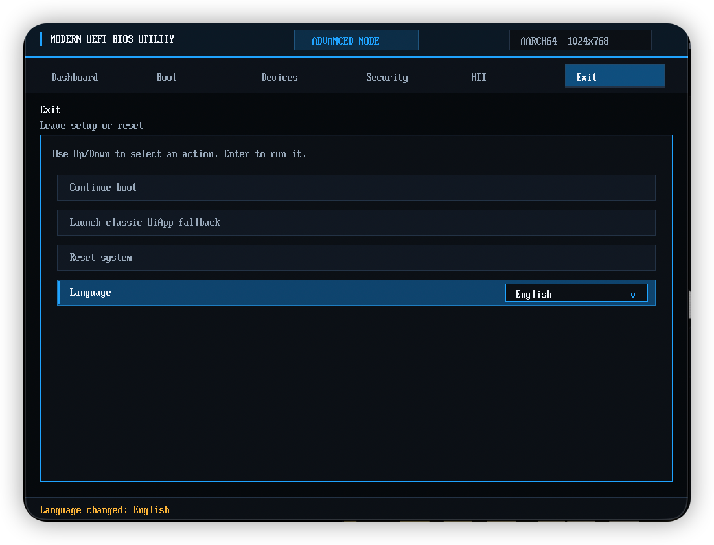
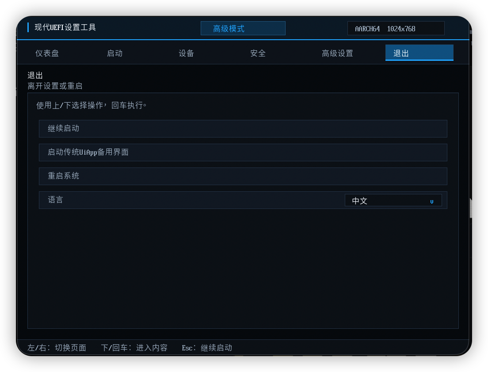

# ModernSetupPkg

ModernSetupPkg is an experimental edk2 package for a modern graphical firmware
setup shell. The first target is ArmVirtQemu on macOS/Apple Silicon; LoongArch
integration is planned after the ArmVirt prototype is stable.

The UI intentionally uses only open source edk2 interfaces and original visual
assets. Commercial IBV firmware screens are treated only as visual and
interaction references.

## Current Scope

- GOP-based rendering through `ModernUiRendererLib`
- Shared page, tab, row, value, popup, footer, and right-rail visual models
  through `ModernUiEngineLib`
- `ModernDisplayEngineDxe`, an edk2 DisplayEngine-compatible GOP frontend for
  `SetupBrowserDxe/FormBrowser2`
- Minimal built-in 18px anti-aliased glyphs generated from Noto Sans CJK SC
  Regular
- Native edk2 HII/IFR/VFR parsing, GUID formset discovery, ConfigAccess,
  callback, condition, and variable write handling through the existing
  FormBrowser stack
- A standalone `ModernSetupApp`, `ModernUiHiiBridgeLib`, and
  `ModernUiPageAdapterLib` retained only under the experimental prototype path
- ArmVirtQemu overlay scripts that keep upstream `ArmVirtPkg` files unchanged
- Development rules for function contracts, multi-architecture extension points,
  and IBV-friendly adaptation

The default ArmVirt path is now compatibility-first: edk2 still owns HII parsing
and setup semantics, while ModernSetup replaces the display engine drawing
backend. The custom HII bridge remains useful for experiments, but it is not the
main route for Device Manager, DriverSample, Boot Maintenance, or third-party
HII driver pages.

The current DisplayEngine visual direction uses a commercial-IBV-style
advanced-mode structure without reusing commercial artwork. The default theme is
black/orange with yellow focus accents; an experimental black/deep-red/yellow
theme can be selected at build time with `MODERN_SETUP_THEME=red`. These
surfaces are drawn from theme tokens and GOP primitives so OEM-specific styling
can later be provided through theme/layout configuration instead of by changing
HII parsing behavior.

```sh
# Default black/orange theme
ModernSetupPkg/Scripts/build-armvirt.sh

# Experimental black/deep-red/yellow theme
MODERN_SETUP_THEME=red ModernSetupPkg/Scripts/build-armvirt.sh
```

## Architecture

Current code and planned extension points are separated below. The default
engine follows the same separation used by IBV-style setup stacks: FormBrowser
semantics, DisplayEngine frontend, customized display drawing, renderer, and
theme.

```text
edk2 workspace
|
+-- ModernSetupPkg
    |
    +-- Package metadata
    |   |
    |   +-- ModernSetupPkg.dec
    |   +-- ModernSetupPkg.dsc
    |
    +-- Universal
    |   |
    |   +-- ModernDisplayEngineDxe
    |       |
    |       +-- EDKII_FORM_DISPLAY_ENGINE_PROTOCOL producer
    |       +-- EFI_HII_POPUP_PROTOCOL producer
    |       +-- edk2 DisplayEngine behavior
    |       +-- GOP-backed customized drawing backend
    |
    +-- Public interfaces
    |   |
    |   +-- Include/ModernUi/ModernUiEngine.h
    |   +-- Include/ModernUi/ModernUiRenderer.h
    |   +-- Include/ModernUi/ModernUiTheme.h
    |
    +-- Main framework libraries
    |   |
    |   +-- ModernUiCustomizedDisplayLib
    |   |   |
    |   |   +-- edk2 CustomizedDisplayLib-compatible API
    |   |   +-- converts DisplayEngine text cells into engine draw models
    |   |
    |   +-- ModernUiEngineLib
    |   |   |
    |   |   +-- common visual model for page chrome, tabs, rows, values,
    |   |       popups, footer, help panel, and right rail
    |   |   +-- shared by ModernDisplayEngineDxe and experimental app
    |   |
    |   +-- ModernUiRendererLib
    |   |   |
    |   |   +-- GOP framebuffer primitives
    |   |   +-- HII Font text rendering
    |   |   +-- built-in minimal CJK glyph fallback
    |   |
    |   +-- ModernUiInputLib
    |   |   |
    |   |   +-- SimpleTextInputEx keyboard mapping
    |   |   +-- AbsolutePointer optional pointer events
    |   |
    |   +-- ModernUiThemeLib
    |   |   |
    |   |   +-- Dark theme token table
    |
    +-- Experimental prototype path
    |   |
    |   +-- Experimental/ModernSetupApp.dsc
    |   +-- Application/ModernSetupApp
    |   +-- ModernUiInputLib / ModernUiStringLib
    |   +-- ModernUiHiiBridgeLib / ModernUiPageAdapterLib
    |
    +-- Platform integration
    |   |
    |   +-- Scripts/build-armvirt.sh
    |   |   |
    |   |   +-- generates Build/ModernSetupPkgOverlay/*.dsc/*.fdf
    |   |   +-- keeps upstream ArmVirtPkg files unchanged
    |   |
    |   +-- Scripts/run-armvirt.sh
    |       |
    |       +-- QEMU ArmVirt graphics validation
    |
    +-- Project records
    |   |
    |   +-- Assets/Brand
    |   +-- Assets/Fonts
    |   +-- Scripts/generate-font-glyphs.py
    |   +-- Docs/DEVELOPMENT.md
    |   +-- CHANGELOG.md
    |   +-- LICENSE
    |
    +-- Tests
        |
        +-- Manual/ArmVirtQemu.md
        +-- Smoke       (planned)
        +-- Unit        (planned)
```

The intended dependency direction is:

```text
Driver VFR / UNI / ConfigAccess
  |
  +--> HII database
        |
        +--> SetupBrowserDxe / FormBrowser2
               |
               +--> EDKII_FORM_DISPLAY_ENGINE_PROTOCOL
                      |
                      +--> ModernDisplayEngineDxe
                             |
                             +--> ModernUiCustomizedDisplayLib
                                    |
                                    +--> ModernUiEngineLib
                                    |      |
                                    |      +--> IBV-style chrome, statement
                                    |           surfaces, popup/input visuals,
                                    |           and layout reservations
                                    |
                                    +--> ModernUiRendererLib / Theme / Fonts
                                           |
                                           +--> EFI_GRAPHICS_OUTPUT_PROTOCOL
```

Default platform-specific integration should enter through overlay DSC/FDF files
or future DisplayEngine/customized display PCDs. Page parsing, callback flow, and
variable routing remain owned by edk2 FormBrowser.

## Experimental Prototype Path

`ModernSetupApp`, `ModernUiHiiBridgeLib`, `ModernUiPageAdapterLib`,
`ModernUiInputLib`, and `ModernUiStringLib` are retained as experimental code
from the earlier self-contained setup shell. They are useful for comparison,
debugging, and prototyping UI ideas, but they are not part of the default
ArmVirt setup compatibility path.

The experimental app should share `ModernUiEngineLib` for visual surfaces. App
code may own demo data, navigation state, and language switching, but should not
grow a second tab, row, popup, or footer renderer.

Build the legacy prototype explicitly with:

```sh
ModernSetupPkg/Scripts/build-modern-app.sh
APP=1 GRAPHICS=1 RESET_VARS=1 ACCEL=hvf ModernSetupPkg/Scripts/run-armvirt.sh
```

Do not use the experimental HII bridge as a platform setup compatibility layer.
Real VFR/IFR pages should continue through native edk2 FormBrowser and
`ModernDisplayEngineDxe`.

## Development Documents

- `Docs/DEVELOPMENT.md` defines coding rules, function comment requirements,
  architecture boundaries, and extension points.
- `CHANGELOG.md` records development progress, user-visible changes, and planned
  version work.
- `Tests/README.md` defines the test layout and current validation scope.

## Build and Run

Add this repository as a submodule at the root of an edk2 workspace:

```sh
git submodule add git@github.com:MarsDoge/ModernSetupPkg.git ModernSetupPkg
git submodule update --init --recursive
```

Build ArmVirtQemu:

```sh
ModernSetupPkg/Scripts/build-armvirt.sh
```

The ArmVirt overlay includes edk2 `DriverSampleDxe` by default so the native
Device Manager/FormBrowser path has a known VFR test target. To build without
that demo driver:

```sh
MODERN_SETUP_DEMO_DRIVER_SAMPLE=0 ModernSetupPkg/Scripts/build-armvirt.sh
```

The renderer asks GOP for a larger display mode during initialization. If the
firmware exposes a suitable mode, it switches away from small 800x600 defaults
to at least 1024x768.

Run with graphics:

```sh
GRAPHICS=1 RESET_VARS=1 ModernSetupPkg/Scripts/run-armvirt.sh
```

On macOS, `ACCEL=hvf` defaults to `gic-version=2` because QEMU HVF can stop
advancing during the BDS wait countdown with ArmVirt `gic-version=3`. Override
with `GIC_VERSION=3` only when testing that specific combination.

Click the QEMU window and press `Esc` or `F2` during BDS wait to enter the
native UiApp firmware setup. Rendering is handled by `ModernDisplayEngineDxe`.

The experimental `ModernSetupApp` is intentionally opt-in. Build it and boot it
from a temporary ArmVirt ESP with:

```sh
ModernSetupPkg/Scripts/build-modern-app.sh
APP=1 GRAPHICS=1 RESET_VARS=1 ACCEL=hvf ModernSetupPkg/Scripts/run-armvirt.sh
```

Without `APP=1`, `run-armvirt.sh` keeps the default native UiApp path.

## Fonts and Text Graphics

Chinese glyphs do not depend on platform firmware fonts. A minimal bitmap table
is generated from Noto Sans CJK SC Regular and compiled into
`ModernUiRendererLib`; ASCII-only text can still use edk2 HII Font rendering.
UEFI box drawing, arrows, triangles, and checkbox glyphs are rendered as narrow
GOP primitives so native FormBrowser frames do not depend on a large font
subset. The full font file is not committed. See `Assets/Fonts/README.md` for
source, license, and regeneration details.

## DisplayEngine Path

`DriverSampleDxe` remains the first compatibility target. The ArmVirt overlay
builds the driver without modifying its `.vfr`, `.uni`, or C source, then edk2
registers the formsets in the HII database. Native `SetupBrowserDxe` and
`FormBrowser2` enumerate the formsets, parse IFR, evaluate conditions, call
ConfigAccess callbacks, and perform writes. `ModernDisplayEngineDxe` receives
the prepared `FORM_DISPLAY_ENGINE_FORM` and statement model and only changes how
the UI is drawn.

This is the intended long-term architecture: keep the edk2 HII contract intact,
replace the old text display backend with a modern GOP surface, and then improve
visual styling inside the DisplayEngine/customized display layer.

## Visual Showcase

The current ArmVirt prototype uses a dense firmware-setup layout: a dark canvas,
a top status bar, horizontal page tabs, raised content panels, setting rows, and
keyboard-first interaction. The style is original, but it intentionally follows
the interaction direction common in high-end UEFI utilities: clear mode/status
signals, strong active-page affordance, and compact settings lists rather than a
legacy text-only form browser.

Screenshots for GitHub presentation belong under `Assets/Screenshots/`. Keep
captures focused on ModernSetup itself, not vendor firmware screens or copied
assets.

Current experimental `ModernSetupApp` captures:







Recommended next captures for the default DisplayEngine path:

- `armvirt-uiapp-frontpage.png` - native UiApp rendered by ModernDisplayEngine.
- `armvirt-device-manager.png` - Device Manager showing automatically loaded
  HII driver pages.
- `armvirt-driver-sample.png` - DriverSample rendered through native
  FormBrowser plus ModernDisplayEngine.

Run the ArmVirt graphics command in the Build and Run section, switch QEMU to
the target page, then capture the window at 1024x768 or larger for README and
GitHub repository presentation.
