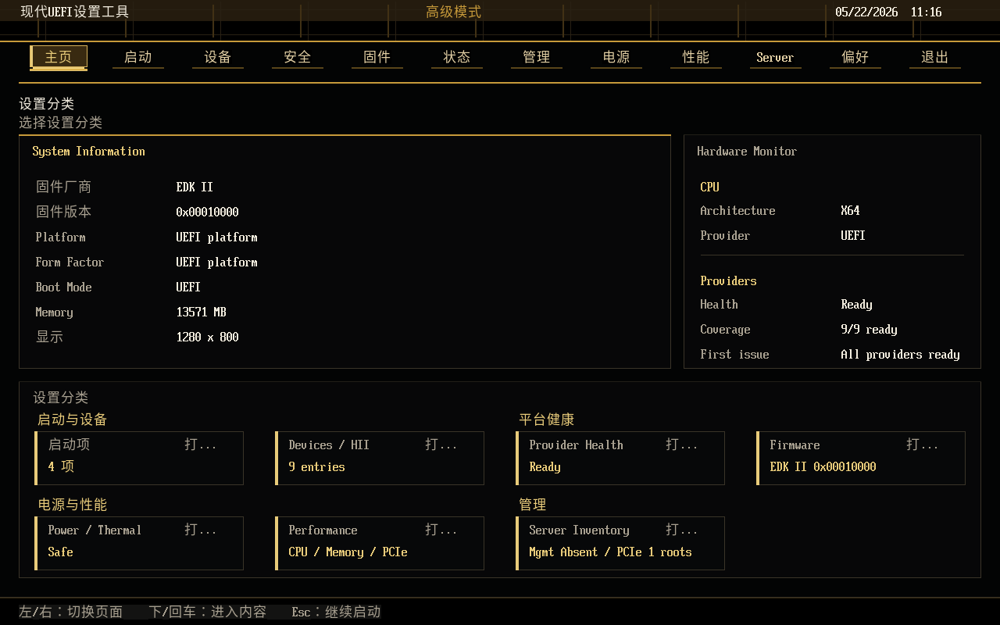
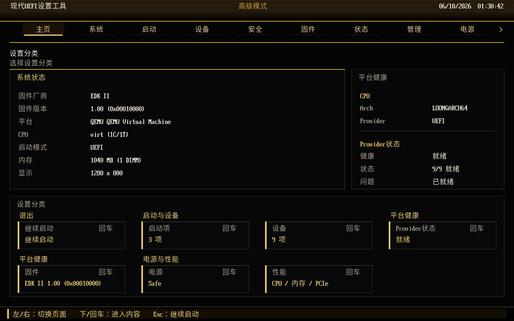
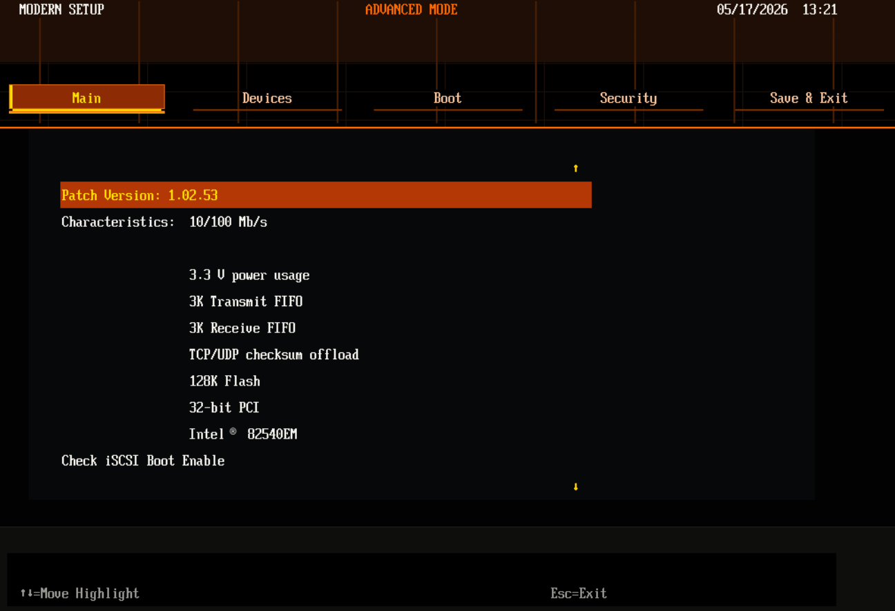
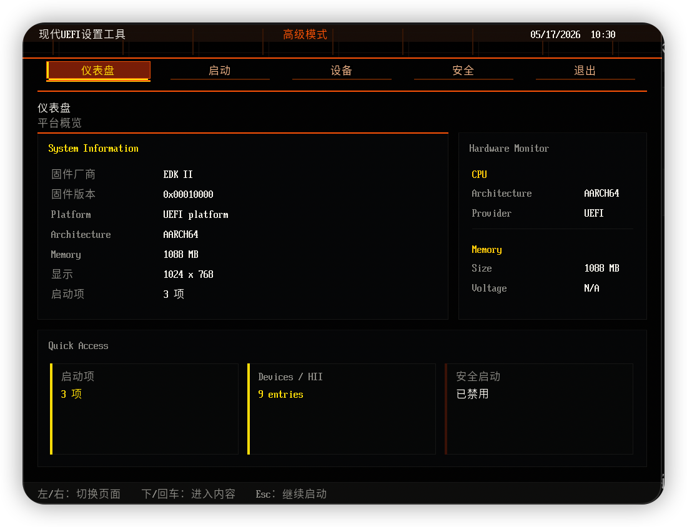
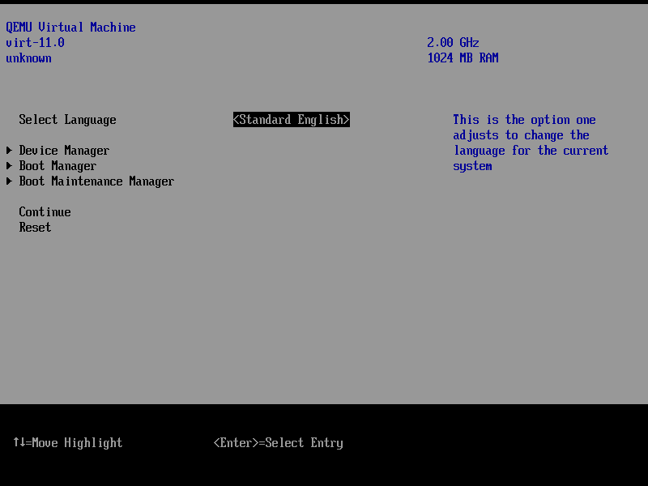
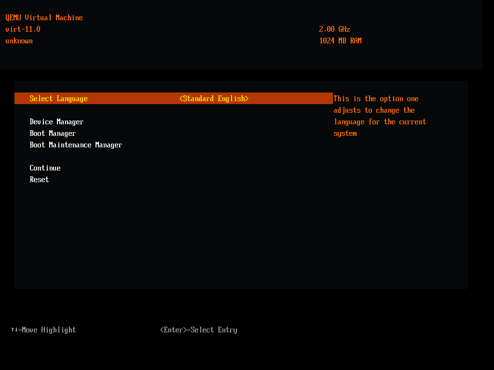
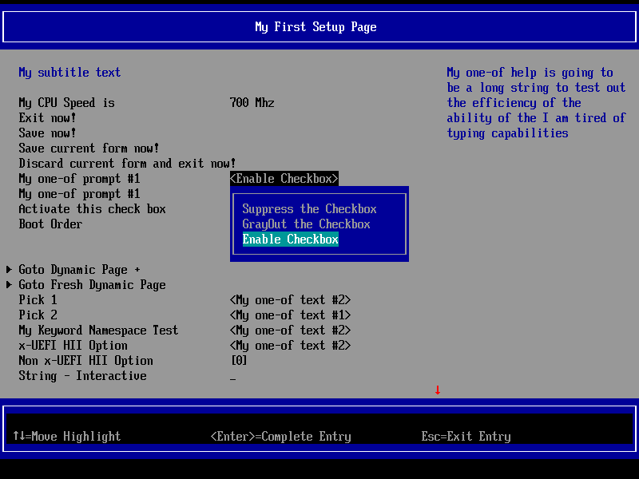
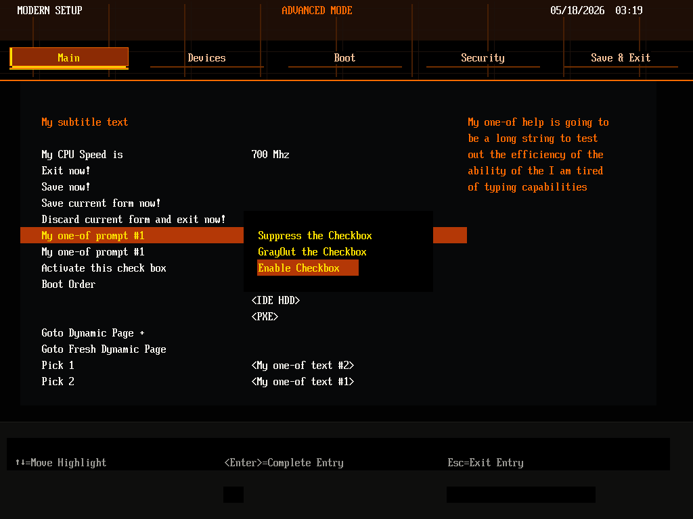

<!--
Copyright (c) 2026, MarsDoge. All rights reserved.
Author: MarsDoge (Dongyan Qian)
Open source: https://github.com/MarsDoge/ModernSetupPkg
SPDX-License-Identifier: BSD-2-Clause-Patent
-->

# ModernSetupPkg

Language: English | [简体中文](README.zh-CN.md)

ModernSetupPkg is an experimental XArch edk2 package for a modern GOP-based UEFI
setup graphics engine and standard front-page shell. XArch is the project's
cross-architecture model for keeping one Setup UX, one HII/FormBrowser ownership
boundary, and one validation vocabulary across X64, AARCH64, LOONGARCH64, and
RISCV64 targets. It keeps edk2 HII/FormBrowser semantics intact while validating
the shared engine on OVMF X64, ArmVirtQemu, LoongArchVirtQemu, and RiscVVirtQemu
build/script paths, with other platform classes treated as future extension
targets.

The UI intentionally uses only open source edk2 interfaces and original visual
assets. Commercial IBV firmware screens are treated only as visual and
interaction references.

## Latest Status

OVMF X64 now has a pinned edk2 baseline, scripted QEMU screendump capture, and a
local/manual `ModernSetupApp` dashboard validation path. The current OVMF
capture shows the shared XArch `ModernUiEngineLib` front-page shell with
Simplified Chinese text, read-only platform summaries, provider health, and the
Graphite Gold app runtime theme after the CJK glyph and Dashboard spacing
polish.



The same graphics stack also renders native FormBrowser pages; edk2 still owns
HII/VFR/IFR parsing, GUID formset discovery, callbacks, and variable writes.

For v0.5, the main XArch validation focus is compatibility evidence: the same
UiApp/FormBrowser pages can be built with either native `DisplayEngineDxe` or
`ModernDisplayEngineDxe` by setting
`MODERN_SETUP_DISPLAY_ENGINE=native|modern`. See
[`Docs/CompatibilityMatrix.md`](Docs/CompatibilityMatrix.md) and
[`Docs/BeforeAfter.md`](Docs/BeforeAfter.md).

The repository now includes scripted ArmVirt before/after captures for
FrontPage, Device Manager, DriverSample first page, and DriverSample one-of
popup through `Scripts/capture-armvirt.sh`.

The next App track is XArch productization rather than architecture-specific
demos. `Docs/XArch.md` defines the target model and validation vocabulary, and
`Docs/ProductizationFeatureMatrix.md` records the common desktop, workstation,
server, embedded, and appliance front-page capabilities that should be filled in
through provider libraries while keeping real setup pages on native FormBrowser.
`Docs/ProductizationValidationMatrix.md` records the Phase30 evidence matrix and
smoke-gate checks for the same XArch/productization boundaries.
For a lightweight target metadata check, run:

```sh
Scripts/xarch-validate.sh --all --mode dry-run
Scripts/xarch-validate.sh --all --mode dry-run --format markdown --output Build/Reports/xarch-validation.md
Scripts/xarch-validate.sh --all --mode dry-run --format json --output Build/XArchValidation.json
```

## Current Scope

- GOP-based rendering through `ModernUiRendererLib`
- Shared page, tab, row, value, popup, footer, and right-rail visual models
  through `ModernUiEngineLib`
- `ModernDisplayEngineDxe`, an edk2 DisplayEngine-compatible GOP frontend for
  `SetupBrowserDxe/FormBrowser2`
- Minimal built-in 18px anti-aliased glyphs generated from Noto Sans CJK SC
  Regular
- Native edk2 HII/IFR/VFR parsing, GUID formset discovery, ConfigAccess,
  callback, condition, and variable write handling through the existing
  FormBrowser stack
- A standalone `ModernSetupApp` standard front-page shell that uses shared
  engine surfaces and opens real HII/VFR pages through native FormBrowser2
- Read-only App providers for firmware lifecycle, diagnostics/table inventory,
  server/remote management, power/thermal, performance/tuning capability, and
  PCIe capability/policy-entry summaries
- XArch documentation for X64, AARCH64, LOONGARCH64, and RISCV64 target mapping,
  validation vocabulary, and ownership boundaries
- ArmVirtQemu overlay scripts that keep upstream `ArmVirtPkg` files unchanged
- LoongArchVirtQemu overlay scripts that keep upstream `OvmfPkg/LoongArchVirt`
  files unchanged
- OVMF X64 overlay scripts that keep upstream `OvmfPkg` files unchanged and
  provide a local/manual QEMU validation path
- RiscVVirtQemu overlay scripts that keep upstream `OvmfPkg/RiscVVirt` files
  unchanged and provide RISCV64 build/script validation
- Development rules for function contracts, XArch extension points,
  and IBV-friendly adaptation

The default ArmVirt path is now compatibility-first: edk2 still owns HII parsing
and setup semantics, while ModernSetup replaces the display engine drawing
backend. The standard front-page app is intentionally separate from that
default path: it can present dashboard, boot, device, security, language, and
theme entry points, but when a real setup page is selected it calls
`EFI_FORM_BROWSER2_PROTOCOL.SendForm()` instead of parsing IFR itself. Broad
IBV/platform setup domains are tracked as read-only summaries or native HII
entry points in `Docs/IbvAndPlatformSetupSurvey.md` and
`Docs/ProductizationFeatureMatrix.md`.

The custom HII bridge remains useful for experiments, but it is not the main
route for Device Manager, DriverSample, Boot Maintenance, or third-party HII
driver pages.

The current DisplayEngine visual direction uses a commercial-IBV-style
advanced-mode structure without reusing commercial artwork. The default
build-time theme is dark/orange with yellow focus accents; an experimental
black/deep-red/yellow theme can be selected at build time with
`MODERN_SETUP_THEME=red`. The app front-page shell also supports runtime theme
preferences such as Graphite Gold, which uses graphite surfaces with warm gold
accents. These surfaces are drawn from theme tokens and GOP primitives so
OEM-specific styling can later be provided through theme/layout configuration
instead of by changing HII parsing behavior.

```sh
# Default dark/orange build-time theme
ModernSetupPkg/Scripts/build-armvirt.sh

# Experimental black/deep-red/yellow theme
MODERN_SETUP_THEME=red ModernSetupPkg/Scripts/build-armvirt.sh
```

## Architecture

Current code and planned extension points are separated below. The default
engine follows the same separation used by IBV-style setup stacks: FormBrowser
semantics, DisplayEngine frontend, customized display drawing, renderer, and
theme.

```text
edk2 workspace
|
+-- ModernSetupPkg
    |
    +-- Package metadata
    |   |
    |   +-- ModernSetupPkg.dec
    |   +-- ModernSetupPkg.dsc
    |
    +-- Universal
    |   |
    |   +-- ModernDisplayEngineDxe
    |       |
    |       +-- EDKII_FORM_DISPLAY_ENGINE_PROTOCOL producer
    |       +-- EFI_HII_POPUP_PROTOCOL producer
    |       +-- edk2 DisplayEngine behavior
    |       +-- GOP-backed customized drawing backend
    |
    +-- Public interfaces
    |   |
    |   +-- Include/ModernUi/ModernUiEngine.h
    |   +-- Include/ModernUi/ModernUiRenderer.h
    |   +-- Include/ModernUi/ModernUiTheme.h
    |   +-- Include/ModernUi/ModernUiPlatformData.h
    |   +-- Include/ModernUi/ModernUiBootData.h
    |   +-- Include/ModernUi/ModernUiDeviceData.h
    |   +-- Include/ModernUi/ModernUiSecurityData.h
    |
    +-- Main framework libraries
    |   |
    |   +-- ModernUiCustomizedDisplayLib
    |   |   |
    |   |   +-- edk2 CustomizedDisplayLib-compatible API
    |   |   +-- converts DisplayEngine text cells into engine draw models
    |   |
    |   +-- ModernUiEngineLib
    |   |   |
    |   |   +-- common visual model for page chrome, tabs, rows, values,
    |   |       popups, footer, help panel, and right rail
    |   |   +-- shared by ModernDisplayEngineDxe and ModernSetupApp
    |   |
    |   +-- ModernUiRendererLib
    |   |   |
    |   |   +-- GOP framebuffer primitives
    |   |   +-- HII Font text rendering
    |   |   +-- built-in minimal CJK glyph fallback
    |   |
    |   +-- ModernUiInputLib
    |   |   |
    |   |   +-- SimpleTextInputEx keyboard mapping
    |   |   +-- AbsolutePointer optional pointer events
    |   |
    |   +-- ModernUiThemeLib
    |   |   |
    |   |   +-- Dark theme token table
    |
    +-- Experimental prototype path
    |   |
    |   +-- Experimental/ModernSetupApp.dsc
    |   +-- Application/ModernSetupApp
    |   +-- ModernUiPlatformDataLib / ModernUiBootDataLib
    |   +-- ModernUiDeviceDataLib / ModernUiSecurityDataLib
    |   +-- ModernUiFirmwareDataLib / ModernUiDiagnosticsDataLib
    |   +-- ModernUiManagementDataLib / ModernUiPowerDataLib
    |   +-- ModernUiPerformanceDataLib / ModernUiPcieDataLib
    |   +-- ModernUiInputLib / ModernUiStringLib
    |   +-- ModernUiHiiBridgeLib / ModernUiPageAdapterLib (debug only)
    |
    +-- Platform integration
    |   |
    |   +-- Scripts/build-armvirt.sh
    |   |   |
    |   |   +-- generates Build/ModernSetupPkgOverlay/*.dsc/*.fdf
    |   |   +-- keeps upstream ArmVirtPkg files unchanged
    |   |
    |   +-- Scripts/run-armvirt.sh
    |   |   |
    |   |   +-- QEMU ArmVirt graphics validation
    |   |
    |   +-- Scripts/build-loongarchvirt.sh
    |   |
    |   +-- Scripts/run-loongarchvirt.sh
    |   |   |
    |   |   +-- QEMU LoongArchVirt graphics validation
    |   |
    |   +-- Scripts/build-ovmf-x64.sh
    |   |
    |   +-- Scripts/build-riscvvirt.sh
    |   |   |
    |   |   +-- RISCV64 overlay/build validation; QEMU run is future work
    |   |
    |   +-- Scripts/run-ovmf-x64.sh
    |       |
    |       +-- QEMU OVMF X64 graphics validation
    |
    +-- Project records
    |   |
    |   +-- Assets/Brand
    |   +-- Assets/Fonts
    |   +-- Scripts/generate-font-glyphs.py
    |   +-- Docs/DEVELOPMENT.md
    |   +-- Docs/XArch.md
    |   +-- Docs/CompatibilityMatrix.md
    |   +-- Docs/BeforeAfter.md
    |   +-- Docs/IbvAndPlatformSetupSurvey.md
    |   +-- Docs/ProductizationFeatureMatrix.md
    |   +-- CHANGELOG.md
    |   +-- LICENSE
    |
    +-- Tests
        |
        +-- Manual/ArmVirtQemu.md
        +-- Manual/LoongArchVirtQemu.md
        +-- Manual/OvmfX64Qemu.md
        +-- Manual/RiscVVirtQemu.md
        +-- Smoke       (planned)
        +-- Unit        (planned)
```

The intended dependency direction is:

```text
Driver VFR / UNI / ConfigAccess
  |
  +--> HII database
        |
        +--> SetupBrowserDxe / FormBrowser2
               |
               +--> EDKII_FORM_DISPLAY_ENGINE_PROTOCOL
                      |
                      +--> ModernDisplayEngineDxe
                             |
                             +--> ModernUiCustomizedDisplayLib
                                    |
                                    +--> ModernUiEngineLib
                                    |      |
                                    |      +--> IBV-style chrome, statement
                                    |           surfaces, popup/input visuals,
                                    |           and layout reservations
                                    |
                                    +--> ModernUiRendererLib / Theme / Fonts
                                           |
                                           +--> EFI_GRAPHICS_OUTPUT_PROTOCOL
```

Default platform-specific integration should enter through overlay DSC/FDF files
or future DisplayEngine/customized display PCDs. Page parsing, callback flow, and
variable routing remain owned by edk2 FormBrowser.

The optional ModernSetupApp path is a front-page shell, not a second setup
browser:

```text
ModernSetupApp
  |
  +--> ModernUiPlatformDataLib / BootDataLib / DeviceDataLib / SecurityDataLib
  |
  +--> ModernUiEngineLib -> ModernUiRendererLib -> GOP
  |
  +--> EFI_FORM_BROWSER2_PROTOCOL.SendForm()
          |
          +--> SetupBrowserDxe/FormBrowser2 -> ModernDisplayEngineDxe
```

## Standard Front-Page App

`ModernSetupApp` is an opt-in standard firmware front page. It is meant to be a
portable open source XArch shell for desktop, laptop, server, tablet, and future
architecture targets. It owns high-level navigation and summary pages only:
dashboard, boot list, HII/device entry list, security overview, firmware
update status, diagnostics inventory, management availability, power/thermal
state, performance/tuning entry availability, PCIe capability and native policy
entry hints, exit, language, and theme controls.

The productization target is documented in
[`Docs/IbvAndPlatformSetupSurvey.md`](Docs/IbvAndPlatformSetupSurvey.md) and
[`Docs/ProductizationFeatureMatrix.md`](Docs/ProductizationFeatureMatrix.md).
New App features should first fit one of those common provider-backed areas:
platform inventory, boot, devices/HII entry points, security posture, firmware
update, diagnostics/logs, management, power/thermal, performance/tuning, or
exit/session control. Platform-private configuration remains in the owning HII
formset. `ModernUiPcieDataLib` follows the same rule for PCIe: it reports a
read-only capability summary and native entry hints, while real ReBAR, Above 4G,
SR-IOV, ASPM, bifurcation, hot-plug, ACS/ARI, IOMMU, and BAR resource policy
changes remain in platform HII/FormBrowser ownership.

The app must share `ModernUiEngineLib` for visual surfaces. App code may own
front-page data, navigation state, and language switching, but should not grow a
second tab, row, popup, or footer renderer. It also must not parse VFR/IFR, call
ConfigAccess directly, or write HII varstores. Device/setup entries are opened
with native FormBrowser2 so edk2 keeps GUID formset handling, callbacks,
conditions, validation, defaults, and variable routing.

`ModernUiHiiBridgeLib` and `ModernUiPageAdapterLib` are retained as
experimental/debug code only. They are not linked into the standard
`ModernSetupApp` build.

Build the app explicitly with:

```sh
ModernSetupPkg/Scripts/build-modern-app.sh
APP=1 GRAPHICS=1 RESET_VARS=1 ACCEL=hvf ModernSetupPkg/Scripts/run-armvirt.sh
```

The app build script defaults to `ARCH=AARCH64` and `TOOL_CHAIN_TAG=CLANGDWARF`.
It also accepts `ARCH=X64` for an OVMF-compatible app build. Run it from an
edk2 workspace checkout or set `WORKSPACE=/path/to/edk2`; when the package is
checked out next to that workspace instead of under it, the script adds the
package parent to `PACKAGES_PATH` for this invocation.

Do not use the experimental HII bridge as a platform setup compatibility layer.
Real VFR/IFR pages should continue through native edk2 FormBrowser and
`ModernDisplayEngineDxe`.

## Development Documents

- Documentation index: [`Docs/README.md`](Docs/README.md) and
  [`Docs/README.zh-CN.md`](Docs/README.zh-CN.md).
- `Docs/DEVELOPMENT.md` defines coding rules, function comment requirements,
  architecture boundaries, and extension points.
- `Docs/XArch.md` defines the XArch model, concrete target mapping, validation
  vocabulary, maturity table, and ownership boundaries.
- `Docs/ProductizationFeatureMatrix.md` defines the XArch App
  feature roadmap and provider boundaries.
- `Docs/IbvAndPlatformSetupSurvey.md` records the public IBV/OEM/platform-form
  setup surface survey used to decide common App pages.
- `CHANGELOG.md` records development progress, user-visible changes, and planned
  version work.
- `Tests/README.md` defines the test layout and current validation scope.

## Build and Run

Add this repository as a submodule at the root of an edk2 workspace:

```sh
git submodule add git@github.com:MarsDoge/ModernSetupPkg.git ModernSetupPkg
git submodule update --init --recursive
```

Build ArmVirtQemu:

```sh
ModernSetupPkg/Scripts/build-armvirt.sh
```

The ArmVirt overlay includes edk2 `DriverSampleDxe` by default so the native
Device Manager/FormBrowser path has a known VFR test target. To build without
that demo driver:

```sh
MODERN_SETUP_DEMO_DRIVER_SAMPLE=0 ModernSetupPkg/Scripts/build-armvirt.sh
```

Build LoongArchVirtQemu:

```sh
export GCC_LOONGARCH64_PREFIX=loongarch64-unknown-linux-gnu-
ModernSetupPkg/Scripts/build-loongarchvirt.sh
```

LoongArchVirt currently follows upstream edk2's GCC-based path. The build
script checks for `${GCC_LOONGARCH64_PREFIX}gcc` and
`${GCC_LOONGARCH64_PREFIX}objcopy` before compiling. On macOS, QEMU can be
installed with Homebrew, but the LoongArch GCC/binutils cross toolchain must be
provided separately.

To inspect the generated LoongArch overlay before the cross toolchain is
available:

```sh
GENERATE_ONLY=1 ModernSetupPkg/Scripts/build-loongarchvirt.sh
```

Build OVMF X64 from the same edk2 workspace:

```sh
ModernSetupPkg/Scripts/build-ovmf-x64.sh
```

For X64 OVMF before/after DisplayEngine comparison:

```sh
MODERN_SETUP_DISPLAY_ENGINE=native ModernSetupPkg/Scripts/build-ovmf-x64.sh
MODERN_SETUP_DISPLAY_ENGINE=modern ModernSetupPkg/Scripts/build-ovmf-x64.sh
```

To inspect the generated OVMF X64 overlay without compiling firmware:

```sh
GENERATE_ONLY=1 ModernSetupPkg/Scripts/build-ovmf-x64.sh
```

Build RiscVVirtQemu from the same edk2 workspace:

```sh
export GCC_RISCV64_PREFIX=riscv64-linux-gnu-
ModernSetupPkg/Scripts/build-riscvvirt.sh
```

The RiscVVirt build path requires a RISC-V GCC/binutils cross toolchain; the
script checks for `${GCC_RISCV64_PREFIX}gcc` and
`${GCC_RISCV64_PREFIX}objcopy` before compiling.

For RISCV64 before/after DisplayEngine overlay generation or build validation:

```sh
MODERN_SETUP_DISPLAY_ENGINE=native ModernSetupPkg/Scripts/build-riscvvirt.sh
MODERN_SETUP_DISPLAY_ENGINE=modern ModernSetupPkg/Scripts/build-riscvvirt.sh
```

To inspect the generated RiscVVirt overlay without a RISC-V cross toolchain:

```sh
GENERATE_ONLY=1 ModernSetupPkg/Scripts/build-riscvvirt.sh
```

The RiscVVirt path is build/script validation only in this phase; no graphical
QEMU RISC-V run helper is provided yet.

The renderer asks GOP for a larger display mode during initialization. If the
firmware exposes a suitable mode, it switches away from small 800x600 defaults
to at least 1024x768.

Run with graphics:

```sh
GRAPHICS=1 RESET_VARS=1 ModernSetupPkg/Scripts/run-armvirt.sh
```

On macOS, `ACCEL=hvf` defaults to `gic-version=2` because QEMU HVF can stop
advancing during the BDS wait countdown with ArmVirt `gic-version=3`. Override
with `GIC_VERSION=3` only when testing that specific combination.

Click the QEMU window and press `Esc` or `F2` during BDS wait to enter the
native UiApp firmware setup. Rendering is handled by `ModernDisplayEngineDxe`.

Run LoongArchVirtQemu with graphics:

```sh
GRAPHICS=1 RESET_VARS=1 ModernSetupPkg/Scripts/run-loongarchvirt.sh
```

The LoongArch run path uses native UiApp plus ModernDisplayEngine, matching the
default ArmVirt compatibility path. It does not boot `ModernSetupApp` by
default.

Run OVMF X64 with graphics:

```sh
GRAPHICS=1 RESET_VARS=1 ModernSetupPkg/Scripts/run-ovmf-x64.sh
```

The OVMF X64 path is currently a local/manual QEMU validation path, not a CI
gate. It uses native UiApp plus ModernDisplayEngine in the default modern build
and supports native/modern DisplayEngine before/after rebuilds.

To boot the experimental front-page App on LoongArch, build a LoongArch ESP and
attach it explicitly:

```sh
GCC_LOONGARCH64_PREFIX=loongarch64-linux-gnu- ARCH=LOONGARCH64 ModernSetupPkg/Scripts/build-modern-app.sh
APP=1 GRAPHICS=1 RESET_VARS=1 ModernSetupPkg/Scripts/run-loongarchvirt.sh
```

To keep native UiApp available while also attaching the ModernSetupApp ESP:

```sh
GCC_LOONGARCH64_PREFIX=loongarch64-linux-gnu- ARCH=LOONGARCH64 ModernSetupPkg/Scripts/build-modern-app.sh
DUAL_APP=1 GRAPHICS=1 RESET_VARS=1 ModernSetupPkg/Scripts/run-loongarchvirt.sh
```

On Linux, the script prefers a QEMU binary with `gtk` or `sdl` display support.
If another QEMU appears earlier in `PATH`, override it explicitly:

```sh
QEMU_BIN=/usr/bin/qemu-system-loongarch64 GRAPHICS=1 RESET_VARS=1 ModernSetupPkg/Scripts/run-loongarchvirt.sh
```

Some LoongArch QEMU builds support split pflash images, while others only
support `-bios`. The run script detects this automatically. In `-bios` mode,
`QEMU_VARS.fd` is not attached, so variable persistence is not validated.

For serial-only validation:

```sh
GRAPHICS=0 RESET_VARS=1 ModernSetupPkg/Scripts/run-loongarchvirt.sh
```

`ModernSetupApp` is intentionally opt-in while the default firmware path stays
native UiApp plus ModernDisplayEngine. Build it and boot it from a temporary
ArmVirt ESP with:

```sh
ModernSetupPkg/Scripts/build-modern-app.sh
APP=1 GRAPHICS=1 RESET_VARS=1 ACCEL=hvf ModernSetupPkg/Scripts/run-armvirt.sh
```

To keep native UiApp in firmware while also attaching the ModernSetupApp ESP for
manual selection from Boot Manager:

```sh
ModernSetupPkg/Scripts/build-modern-app.sh
DUAL_APP=1 GRAPHICS=1 RESET_VARS=1 ACCEL=hvf ModernSetupPkg/Scripts/run-armvirt.sh
```

Without `APP=1` or `DUAL_APP=1`, `run-armvirt.sh` keeps the default native UiApp
path.

## Fonts and Text Graphics

Chinese glyphs do not depend on platform firmware fonts. A minimal bitmap table
is generated from Noto Sans CJK SC Regular and compiled into
`ModernUiRendererLib`; ASCII-only text can still use edk2 HII Font rendering.
UEFI box drawing, arrows, triangles, and checkbox glyphs are rendered as narrow
GOP primitives so native FormBrowser frames do not depend on a large font
subset. The full font file is not committed. See `Assets/Fonts/README.md` and
`THIRD_PARTY_NOTICES.md` for source, license, and regeneration details.

## DisplayEngine Path

`DriverSampleDxe` remains the first compatibility target. The ArmVirt overlay
builds the driver without modifying its `.vfr`, `.uni`, or C source, then edk2
registers the formsets in the HII database. Native `SetupBrowserDxe` and
`FormBrowser2` enumerate the formsets, parse IFR, evaluate conditions, call
ConfigAccess callbacks, and perform writes. `ModernDisplayEngineDxe` receives
the prepared `FORM_DISPLAY_ENGINE_FORM` and statement model and only changes how
the UI is drawn.

This is the intended long-term architecture: keep the edk2 HII contract intact,
replace the old text display backend with a modern GOP surface, and then improve
visual styling inside the DisplayEngine/customized display layer.

## Visual Showcase

The current ArmVirt prototype uses a dense firmware-setup layout: a dark canvas,
a top status bar, horizontal page tabs, raised content panels, setting rows, and
keyboard-first interaction. The style is original, but it intentionally follows
the interaction direction common in high-end UEFI utilities: clear mode/status
signals, strong active-page affordance, and compact settings lists rather than a
legacy text-only form browser.

Screenshots for GitHub presentation belong under `Assets/Screenshots/`. Keep
captures focused on ModernSetup itself, not vendor firmware screens or copied
assets.

Current OVMF X64 capture:


Current LoongArch captures:





Current ArmVirt `ModernSetupApp` captures:




Current ArmVirt before/after DisplayEngine captures:









For repeatable local captures, build the desired path and run:

```sh
CAPTURE_PREFIX=before-armvirt ModernSetupPkg/Scripts/capture-armvirt.sh
CAPTURE_PREFIX=after-armvirt ModernSetupPkg/Scripts/capture-armvirt.sh
```

## License and Notices

ModernSetupPkg is licensed under `BSD-2-Clause-Patent`; see `LICENSE`.
Third-party attribution, generated font subset notices, screenshot provenance,
brand asset provenance, and trademark disclaimers are documented in
[`THIRD_PARTY_NOTICES.md`](THIRD_PARTY_NOTICES.md).
