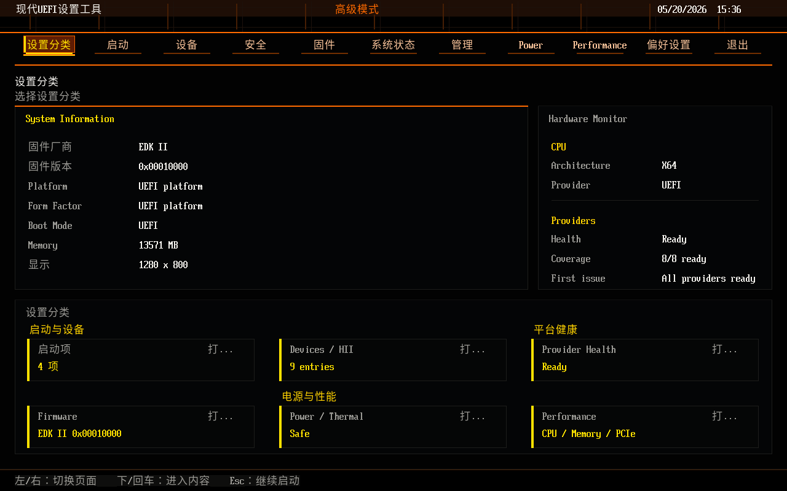

<!--
Copyright (c) 2026, MarsDoge. All rights reserved.
Author: MarsDoge (Dongyan Qian)
Open source: https://github.com/MarsDoge/ModernSetupPkg
SPDX-License-Identifier: BSD-2-Clause-Patent
-->

# ModernSetupPkg

语言：[English](README.md) | 简体中文

ModernSetupPkg 是一个实验性 XArch edk2 package，用于现代 GOP-based UEFI Setup 图形引擎和标准首页 shell。XArch 是本项目的跨架构模型，用同一套 Setup UX、同一条 HII/FormBrowser 所有权边界和同一套验证词汇覆盖 X64、AARCH64、LOONGARCH64、RISCV64 目标。

项目保持 edk2 HII/FormBrowser 语义不变：HII/VFR/IFR 解析、GUID formset 发现、callbacks、defaults、validation 和变量写入仍归 edk2 FormBrowser 与平台 HII 驱动所有。`ModernSetupApp` 只提供首页导航、只读摘要、App 私有偏好和进入原生 FormBrowser2 的入口。

UI 只使用开源 edk2 接口和原创视觉资产。商业 IBV 固件界面只作为视觉和交互参考，不复制闭源代码、字体、图标、图片、布局或专有资产。

## 最新状态

OVMF X64 已有固定 edk2 baseline、脚本化 QEMU screendump 捕获，以及本地/手工 `ModernSetupApp` dashboard 验证路径。当前 OVMF 捕获展示了共享 XArch `ModernUiEngineLib` 首页壳层、简体中文文本、只读平台摘要、provider health，以及 CJK 字形和 Dashboard 间距打磨后的黑/橙 advanced-mode theme。



同一 graphics stack 也用于渲染原生 FormBrowser 页面；edk2 仍拥有 HII/VFR/IFR 解析、GUID formset discovery、callbacks 和 variable writes。

v0.5 的 XArch 重点是兼容性证据：同一 UiApp/FormBrowser 页面可通过 `MODERN_SETUP_DISPLAY_ENGINE=native|modern` 在原生 `DisplayEngineDxe` 和 `ModernDisplayEngineDxe` 之间切换构建。参考 `Docs/CompatibilityMatrix.md` 和 `Docs/BeforeAfter.md`。

## 当前范围

- 通过 `ModernUiRendererLib` 进行 GOP-based rendering。
- 通过 `ModernUiEngineLib` 共享 page、tab、row、value、popup、footer、right-rail 视觉模型。
- `ModernDisplayEngineDxe`：兼容 edk2 DisplayEngine 的 GOP frontend，用于 `SetupBrowserDxe/FormBrowser2`。
- 来自 Noto Sans CJK SC Regular 的最小内置 18px 抗锯齿字形。
- 原生 edk2 HII/IFR/VFR、GUID formset discovery、ConfigAccess、callback、condition 和 variable write handling。
- 独立 `ModernSetupApp` 标准首页 shell：使用共享 engine surfaces，并通过 native FormBrowser2 打开真实 HII/VFR 页面。
- 固件生命周期、diagnostics/table inventory、server/remote management、power/thermal、performance/tuning、PCIe capability/policy-entry 的只读 App providers。
- XArch 文档：X64、AARCH64、LOONGARCH64、RISCV64 目标映射、验证词汇和所有权边界。
- ArmVirtQemu、LoongArchVirtQemu、OVMF X64、RiscVVirtQemu overlay 脚本；上游平台文件保持不变。
- 函数契约、XArch 扩展点和 IBV-friendly adaptation 的开发规则。

默认平台集成路径是 compatibility-first：edk2 拥有 HII parsing 和 setup semantics，ModernSetup 替换 DisplayEngine drawing backend。标准首页 App 与默认路径分离；它可以显示 dashboard、boot、device、security、language、theme 等入口，但选择真实 setup 页面时调用 `EFI_FORM_BROWSER2_PROTOCOL.SendForm()`，而不是自己解析 IFR。

## 架构概览

核心依赖方向：

```text
Driver VFR / UNI / ConfigAccess
  -> HII database
     -> SetupBrowserDxe / FormBrowser2
        -> EDKII_FORM_DISPLAY_ENGINE_PROTOCOL
           -> ModernDisplayEngineDxe
              -> ModernUiCustomizedDisplayLib
                 -> ModernUiEngineLib
                 -> ModernUiRendererLib / Theme / Fonts
                    -> EFI_GRAPHICS_OUTPUT_PROTOCOL
```

可选 `ModernSetupApp` 路径是首页壳层，不是第二个 setup browser：

```text
ModernSetupApp
  -> ModernUiPlatformDataLib / BootDataLib / DeviceDataLib / SecurityDataLib
  -> ModernUiEngineLib -> ModernUiRendererLib -> GOP
  -> EFI_FORM_BROWSER2_PROTOCOL.SendForm()
     -> SetupBrowserDxe/FormBrowser2 -> ModernDisplayEngineDxe
```

平台特定集成应通过 overlay DSC/FDF 或未来 DisplayEngine/customized display PCDs 进入。页面解析、callback flow 和 variable routing 仍由 edk2 FormBrowser 拥有。

## 标准首页 App

`ModernSetupApp` 是 opt-in 标准固件首页。它面向 desktop、laptop、server、tablet 和未来架构目标，负责高层导航和摘要页面：dashboard、boot list、HII/device entry list、security overview、firmware update status、diagnostics inventory、management availability、power/thermal state、performance/tuning entry availability、PCIe capability/native policy entry hints、exit、language 和 theme controls。

真实配置动作不属于 App：boot order editing、Secure Boot key enrollment、TPM physical presence、fan curves、CPU voltage/frequency、memory timing、PCIe resource policy、BMC networking 等应继续进入原生 HII/FormBrowser 或平台工具。

## 开发文档

- 文档索引：英文 [`Docs/README.md`](Docs/README.md)，中文 [`Docs/README.zh-CN.md`](Docs/README.zh-CN.md)。
- [`Docs/DEVELOPMENT.zh-CN.md`](Docs/DEVELOPMENT.zh-CN.md) / [`Docs/DEVELOPMENT.md`](Docs/DEVELOPMENT.md)：编码规则、函数注释、架构边界和扩展点。
- [`Docs/XArch.zh-CN.md`](Docs/XArch.zh-CN.md) / [`Docs/XArch.md`](Docs/XArch.md)：XArch 模型、具体目标映射、验证词汇、成熟度和所有权边界。
- [`Docs/ProductizationFeatureMatrix.zh-CN.md`](Docs/ProductizationFeatureMatrix.zh-CN.md) / [`Docs/ProductizationFeatureMatrix.md`](Docs/ProductizationFeatureMatrix.md)：XArch App 功能路线图和 provider 边界。
- [`Docs/ProductizationValidationMatrix.zh-CN.md`](Docs/ProductizationValidationMatrix.zh-CN.md) / [`Docs/ProductizationValidationMatrix.md`](Docs/ProductizationValidationMatrix.md)：Phase30 XArch 产品化证据矩阵和 smoke gate 检查。
- [`Docs/MODULE_BOUNDARIES.zh-CN.md`](Docs/MODULE_BOUNDARIES.zh-CN.md) / [`Docs/MODULE_BOUNDARIES.md`](Docs/MODULE_BOUNDARIES.md)：稳定契约和层级规则。
- [`Docs/IbvAndPlatformSetupSurvey.zh-CN.md`](Docs/IbvAndPlatformSetupSurvey.zh-CN.md) / [`Docs/IbvAndPlatformSetupSurvey.md`](Docs/IbvAndPlatformSetupSurvey.md)：IBV/OEM/platform form setup surface 调研。
- `CHANGELOG.md`：开发进度、用户可见变化和计划版本工作。
- `Tests/README.md`：测试布局和当前验证范围。

## 构建和运行

把仓库作为 edk2 workspace 根目录下的 submodule：

```sh
git submodule add git@github.com:MarsDoge/ModernSetupPkg.git ModernSetupPkg
git submodule update --init --recursive
```

ArmVirtQemu：

```sh
ModernSetupPkg/Scripts/build-armvirt.sh
GRAPHICS=1 RESET_VARS=1 ModernSetupPkg/Scripts/run-armvirt.sh
```

LoongArchVirtQemu：

```sh
export GCC_LOONGARCH64_PREFIX=loongarch64-unknown-linux-gnu-
ModernSetupPkg/Scripts/build-loongarchvirt.sh
GRAPHICS=1 RESET_VARS=1 ModernSetupPkg/Scripts/run-loongarchvirt.sh
```

OVMF X64：

```sh
ModernSetupPkg/Scripts/build-ovmf-x64.sh
GRAPHICS=1 RESET_VARS=1 ModernSetupPkg/Scripts/run-ovmf-x64.sh
```

RiscVVirtQemu 构建/脚本验证：

```sh
export GCC_RISCV64_PREFIX=riscv64-linux-gnu-
ModernSetupPkg/Scripts/build-riscvvirt.sh
```

在没有交叉工具链时，可用 `GENERATE_ONLY=1` 检查 overlay 生成。DisplayEngine 前后对比可用：

```sh
MODERN_SETUP_DISPLAY_ENGINE=native ModernSetupPkg/Scripts/build-ovmf-x64.sh
MODERN_SETUP_DISPLAY_ENGINE=modern ModernSetupPkg/Scripts/build-ovmf-x64.sh
```

XArch 轻量验证：

```sh
Scripts/xarch-validate.sh --all --mode dry-run
Scripts/xarch-validate.sh --all --mode dry-run --format markdown --output Build/Reports/xarch-validation.md
Scripts/xarch-validate.sh --all --mode dry-run --format json --output Build/XArchValidation.json
```

Smoke 验证：

```sh
python3 Tests/Smoke/smoke_validate.py
```

## 许可证

本项目使用 `BSD-2-Clause-Patent`，详见 `LICENSE`。第三方归属、生成字体子集、截图来源、品牌素材来源和商标声明见 [`THIRD_PARTY_NOTICES.md`](THIRD_PARTY_NOTICES.md)；第三方字体和素材的许可证信息也保留在对应目录。
